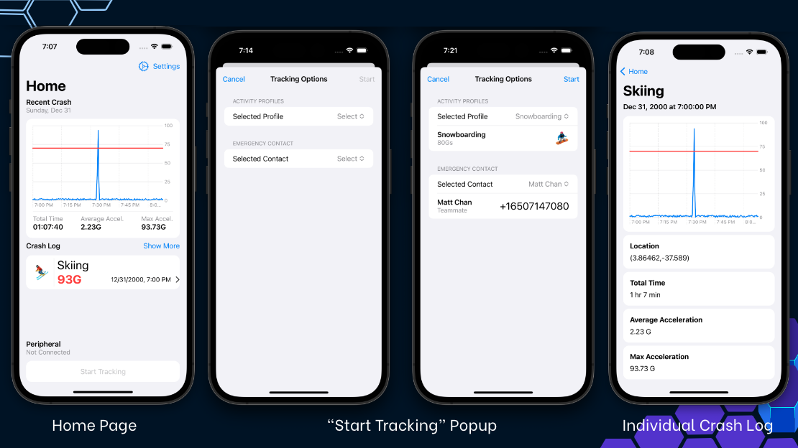

# Crash Buddy iOS

This project was created for our Capstone project at Northeastern University. The goal of this project is to create an iOS application that when paired with a peripheral device, can detect a crash and send a text message to an emergency contact. You can find the project report [here](https://github.com/bradleybares/crash-buddy-ios/blob/main/final_report.pdf) and presentation [here](https://github.com/bradleybares/crash-buddy-ios/blob/main/final_presentation.pdf).

The app consists of 3 main views and a robust settings page. The 3 main views are the home page, the start tracking sheet, and the individual crash log. The home page is where the user can start tracking their ride, view their crash logs, and access their settings. The start tracking sheet is where the user can start tracking their activity, selecting an activity profile, and emergency contact. The individual crash log view is where the user can view the details of a specific crash including the location, time, and recorded acceleration experienced. The settings page is where the user can view and edit their emergency contact and view and edit their activity profiles.

## Requirements

### Xcode

Ensure you have the latest version of Xcode installed. You can install/update it in the App Store.

## Installation

Clone the repository using your preferred method and open the project in Xcode.

## Setup

### Signing

You will need to set up signing for the app to run on your device. You can do this by opening the project in Xcode and selecting the `Fitr` target. Then, select the `Signing & Capabilities` tab and select your team. You will need to sign in with your Apple ID if you haven't already.

### Developer Mode

You will need to enable developer mode on your device. To do this, go to `Settings > General > Device Management` and select your Apple ID. Then, select `Trust`.

## Usage

### Running the App

To run the app, select your device from the device list in the top left corner of Xcode and press the play button.

### Debugging

Logging is done using the `os_log` function. You can view logs in the console in Xcode.

## Status

The project is fully functional and meets all the set goals. This was our first time developing an iOS application and we learned a lot about the platform and Swift. We also learned a lot about the development process and how to work as a team. We are very proud of the work we did, but there are some improvements that could be made. The biggest improvement would be to add unit tests. We did not have time to add unit tests, but we would have liked to. We would also like to add more features to the app such as a map view of the crash location. However, we will not be adding any more features to the app as we are no longer working on it.